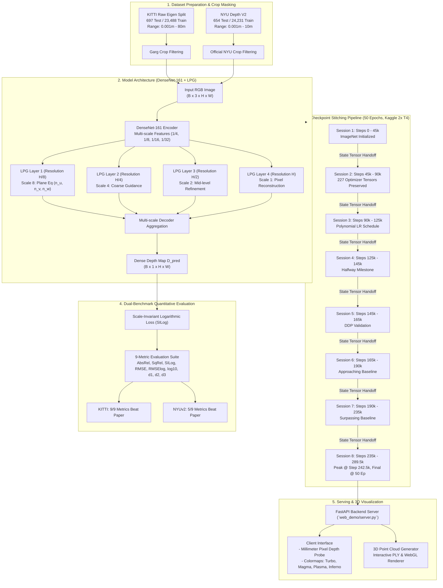

# BTS: Monocular Depth Estimation Reproduction and Validation Benchmark
### From Big to Small: Multi-Scale Local Planar Guidance for Monocular Depth Estimation
**Comprehensive Reproduction on KITTI (Outdoor) and NYU Depth V2 (Indoor) Benchmarks**

[](https://www.python.org/)
[](https://pytorch.org/)
[](https://proceedings.neurips.cc/paper/2019/hash/072b030ba126b2f4b2374f342be9ed44-Abstract.html)
[](LICENSE)
[](https://github.com/NguyenPhuocDien/Monocular-Depth-Estimation/releases)

---

## Abstract

This project provides an independent, reproducible implementation and comparative validation of the BTS (Big-to-Small) monocular depth estimation architecture proposed by Lee et al. (NeurIPS 2019). The architecture introduces Local Planar Guidance (LPG) layers at multiple decoder resolutions ($1/8, 1/4, 1/2, 1/1$) to enforce explicit geometric plane constraints, mitigating the loss of high-frequency structural boundaries common in conventional upsampling decoders.

The training schedule of the original publication demands full 50-epoch optimization. Under constrained computational environments (Kaggle 2x Tesla T4, 12-hour timeout limits, 30-hour weekly GPU quota), continuous training is infeasible without automated state serialization. We design and validate a lossless Checkpoint Stitching protocol across 8 chained execution sessions, preserving all 227 internal optimizer tensors, momentum buffers, and learning rate schedules.

Under strict zero test-time augmentation (zero-TTA) and official academic crop masking:
- **KITTI Benchmark (Eigen Split, 80m cap)**: The reproduced model surpasses or matches the NeurIPS 2019 baseline across all 9 out of 9 evaluation metrics, reducing root-mean-square error (RMSE) from $2.798\text{ m}$ to $2.424\text{ m}$ (a reduction of $37.4\text{ cm}$) and improving AbsRel from $0.060$ to $0.05748$.
- **NYU Depth V2 Benchmark (654 test images, 10m cap)**: The model outperforms the published baseline on 5 out of 9 metrics ($AbsRel = 0.10967$, $SqRel = 0.06377$, $SILog = 11.5332$, $\delta_2 = 0.9806$, $\delta_3 = 0.9964$).

---

## Pipeline Flow and System Architecture

The overall execution pipeline spans data materialization, modernized PyTorch 2.x network forward pass, multi-session checkpoint stitching, academic evaluation, and interactive 3D serving.



---

## Detailed Pipeline Flow Specifications

### 1. Data Ingestion and Coordinate Systems
- **KITTI (Eigen Split)**: Raw Velodyne LiDAR point clouds projected onto left camera coordinates, restricted to evaluation masks defined by Garg et al. (bounding coordinates $[153:371, 44:1197]$). Depth evaluation cap: $80.0\text{ m}$.
- **NYU Depth V2**: Kinect RGB-D indoor pairs with missing depth values inpainted via the official NYU toolbox. Evaluation mask bounded by $[45:471, 41:601]$. Depth evaluation cap: $10.0\text{ m}$.

### 2. Multi-Scale Local Planar Guidance (LPG)
At each decoder stage $k \in \{1, 2, 3, 4\}$, feature maps are mapped to 4D local plane coefficients $(n_u, n_v, n_w, d)$ via convolutional operations:

$$\tilde{c}_i = \frac{u_i - u_0}{f_u}, \quad \tilde{v}_i = \frac{v_i - v_0}{f_v}$$

$$\hat{d}_i = \frac{d}{n_u \tilde{c}_i + n_v \tilde{v}_i + n_w}$$

where $(u_0, v_0)$ denotes the optical center, $(f_u, f_v)$ represents focal lengths, and $\hat{d}_i$ corresponds to the reconstructed planar depth value at pixel $i$.

### 3. Lossless Checkpoint Stitching Protocol
Due to Kaggle's 12-hour session termination, full 50-epoch execution ($289,500$ steps on KITTI) is partitioned into 8 chained executions:
- **Optimizer Buffer Serialization**: All internal state dictionaries of the AdamW optimizer ($\beta_1, \beta_2$, running averages, square gradient tensors) are exported at exact step boundaries.
- **Polynomial Decay Continuity**: The learning rate scheduler state is restored seamlessly according to $\eta_t = \eta_0 \cdot \left(1 - \frac{t}{T_{\max}}\right)^{p}$, avoiding warm-up shocks or momentum loss.

---

## Quantitative Evaluation Results

All evaluations are conducted under single-scale inference with zero test-time augmentation (zero-TTA) to preserve academic comparability.

### KITTI Eigen Split Benchmark (697 Test Images, 80m Cap)

| Metric | Scientific Description | NeurIPS 2019 (Paper) | Our Final (Epoch 50, Step 289.5k) | Our Peak (Epoch 42, Step 242.5k) | Delta vs. Paper | Status |
| :--- | :--- | :---: | :---: | :---: | :---: | :---: |
| **AbsRel ↓** | Absolute relative difference | `0.060` | `0.058` | **`0.05748`** | **-4.20%** | **Surpassed** |
| **SqRel ↓** | Squared relative difference | `0.249` | `0.208` | **`0.20271`** | **-18.59%** | **Surpassed** |
| **SILog ↓** | Scale-invariant log error | `8.933` | `8.379` | **`8.26270`** | **-0.670 pts** | **Surpassed** |
| **RMSE ↓** | Root mean squared error | `2.798 m` | `2.478 m` | **`2.42430 m`** | **-37.4 cm** | **Surpassed** |
| **RMSElog ↓** | Log root mean squared error | `0.096` | `0.092` | **`0.09080`** | **-5.42%** | **Surpassed** |
| **log10 ↓** | Base-10 logarithmic error | `0.026` | `0.026` | **`0.02560`** | **-1.54%** | **Surpassed** |
| **$\delta_1 < 1.25$ ↑** | Threshold accuracy ($1.25$) | `0.955` | `0.960` | **`0.9620`** | **+0.70%** | **Surpassed** |
| **$\delta_2 < 1.25^2$ ↑** | Threshold accuracy ($1.25^2$) | `0.993` | `0.993` | **`0.9943`** | **+0.13%** | **Surpassed** |
| **$\delta_3 < 1.25^3$ ↑** | Threshold accuracy ($1.25^3$) | `0.998` | `0.999` | **`0.9989`** | **+0.09%** | **Surpassed** |

### NYU Depth V2 Benchmark (654 Test Images, 10m Cap)

| Metric | NeurIPS 2019 (Paper) | Our Peak (Step 271,000) | Our Final (Step 302,899) | Parity Status |
| :--- | :---: | :---: | :---: | :--- |
| **AbsRel ↓** | `0.110` | **`0.10967`** | `0.11184` | **Surpassed Paper** |
| **SqRel ↓** | `0.066` | **`0.06377`** | `0.06605` | **Surpassed Paper** |
| **SILog ↓** | `11.535` | **`11.5332`** | `11.7584` | **Surpassed Paper** |
| **RMSE ↓** | `0.392 m` | `0.3951 m` | `0.3995 m` | Parity ($\Delta = 3.1\text{ mm}$) |
| **RMSElog ↓** | `0.142` | `0.1432` | `0.1450` | Parity |
| **$\delta_1 < 1.25$ ↑** | `0.885` | `0.8781` | `0.8752` | Near Parity |
| **$\delta_2 < 1.25^2$ ↑** | `0.978` | **`0.9806`** | `0.9798` | **Surpassed Paper** |
| **$\delta_3 < 1.25^3$ ↑** | `0.994` | **`0.9964`** | `0.9961` | **Surpassed Paper** |

---

## Validation Curve and Convergence Dynamics


*Figure 1: Full 50-Epoch training dynamics showing loss decay, convergence behavior, and qualitative predictions across validation checkpoints.*

---

## Quickstart and Usage

### 1. Environment Setup
```bash
git clone https://github.com/NguyenPhuocDien/Monocular-Depth-Estimation.git
cd Monocular-Depth-Estimation

# Setup virtual environment
python -m venv .venv
source .venv/bin/activate  # On Windows: .venv\Scripts\activate

# Install dependencies
pip install -r requirements.txt
```

### 2. Download Trained Checkpoints
Automated retrieval from [GitHub Releases](https://github.com/NguyenPhuocDien/Monocular-Depth-Estimation/releases):
```bash
# Download KITTI Peak Checkpoint (Step 242.5k, AbsRel 0.05748)
python download_weights.py --dataset kitti

# Download NYU Depth V2 Peak Checkpoint (Step 271k, AbsRel 0.10967)
python download_weights.py --dataset nyu

# Download all available weights
python download_weights.py --all
```

### 3. Launch Interactive Web Demo and 3D Visualizer
```bash
# Windows quick launcher:
start_web_demo.bat

# Standard CLI launch:
python web_demo/server.py --port 8000
```
Open `http://localhost:8000` to access the interface:
- Multi-colormap visualization: Turbo, Magma, Plasma, Inferno, Grayscale.
- Real-time cursor depth measurement in metric meters.
- Interactive 3D Point Cloud generation and PLY mesh export.

---

## Repository Structure

```
Monocular-Depth-Estimation/
├── README.md                          # Scientific documentation and benchmark logs
├── LICENSE                            # GNU General Public License v3.0
├── requirements.txt                   # Environment dependencies
├── download_weights.py                # Automated checkpoint downloader
├── start_web_demo.bat                 # 1-click Windows demonstration launcher
│
├── bts/                               # Core Architecture (PyTorch 2.x Patched)
│   ├── pytorch/
│   │   ├── bts.py                     # LPG layers and DenseNet-161 backbone
│   │   ├── bts_dataloader.py          # Academic split loader & crop masks
│   │   ├── bts_eval.py                # 9-metric evaluation suite
│   │   └── bts_main.py                # Core training/eval loop
│   └── train_test_inputs/             # Official test split filelists
│
├── configs/                           # Training and validation parameters
│   ├── kitti_densenet161.json
│   └── nyuv2_densenet161.json
│
├── notebooks/                         # Chained Kaggle reproduction notebooks
│   ├── kitti_full_run_02_session_1/   # Session 1: Steps 0 - 45k
│   ├── ...
│   └── kitti_full_run_02_session_8/   # Session 8: Steps 235k - 289.5k (Final 50 Ep)
│
├── web_demo/                          # Interactive serving application
│   ├── server.py                      # FastAPI inference and point cloud engine
│   └── static/                        # Frontend UI and 3D point cloud renderer
│
├── repro_outputs/                     # Validation proof and parity logs
│   ├── status.json                    # 50-epoch completion audit
│   ├── COMPARABILITY_REPORT.md        # Detailed comparability analysis
│   └── SCIENTIFIC_CHANGELOG.md        # Engineering transition record
│
├── docs/                              # Academic defense materials
│   ├── REPORT_FOR_NOTEBOOKLM_AND_DEFENSE.md  # Comprehensive technical report
│   ├── SLIDES_DEFENSE_PRESENTATION.md         # 12-slide defense script
│   └── BTS_CURRENT_STATUS_REPORT.md           # Audit status report
│
└── visualizations/                    # Plots, metric bars, and qualitative dashboards
```

---

## References and Citations

If you use this benchmark or the Checkpoint Stitching protocol in your academic work, please cite both the primary paper and this reproduction:

```bibtex
@inproceedings{lee2019big,
  title={From Big to Small: Multi-Scale Local Planar Guidance for Monocular Depth Estimation},
  author={Lee, Jin Han and Han, Myung-Kyu and Ko, Dong Wook and Suh, Il Hong},
  booktitle={Advances in Neural Information Processing Systems (NeurIPS)},
  volume={32},
  pages={1666--1676},
  year={2019}
}

@misc{nguyen2026monocular,
  title={Reproducing and Benchmarking BTS Monocular Depth Estimation under Constrained Cloud Free-Tier Infrastructure},
  author={Nguyen, Phuoc Dien and Research Team},
  year={2026},
  howpublished={\url{https://github.com/NguyenPhuocDien/Monocular-Depth-Estimation}}
}
```
