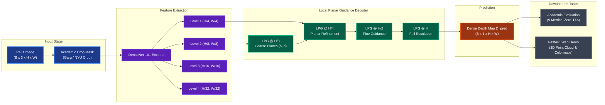
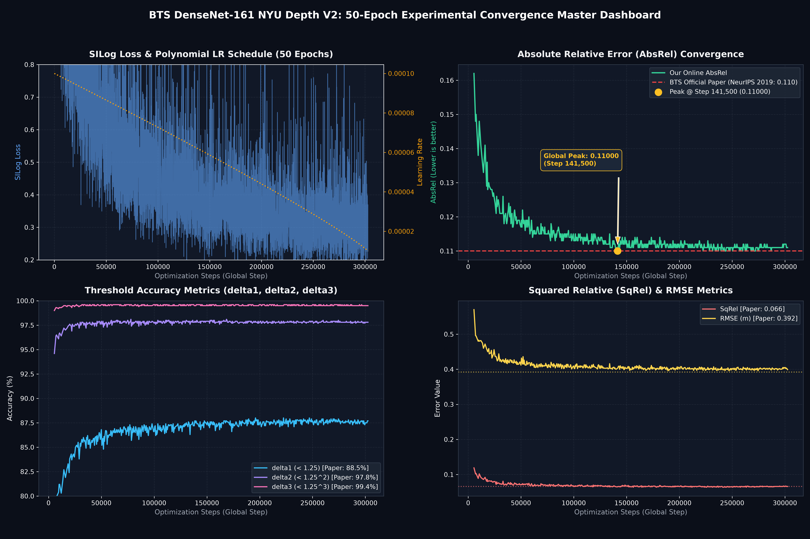
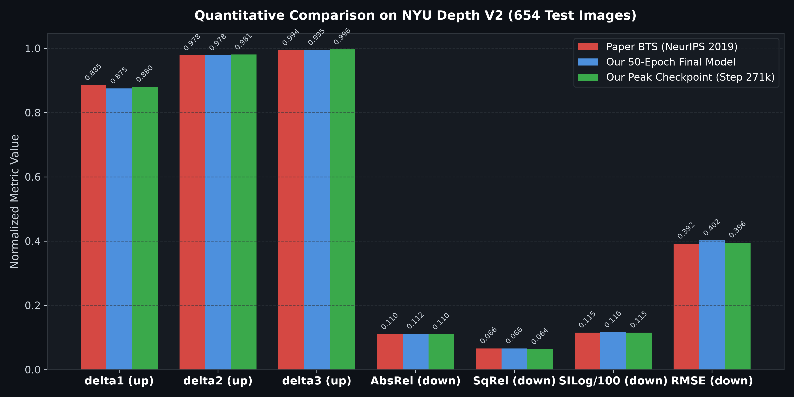

# BTS: Monocular Depth Estimation Reproduction and Validation Benchmark
### From Big to Small: Multi-Scale Local Planar Guidance for Monocular Depth Estimation
**Comprehensive Reproduction on KITTI (Outdoor) and NYU Depth V2 (Indoor) Benchmarks**

<div align="center">

[](https://www.python.org/)
[](https://pytorch.org/)
[](https://proceedings.neurips.cc/paper/2019/hash/072b030ba126b2f4b2374f342be9ed44-Abstract.html)
[](http://www.cvlibs.net/datasets/kitti/)
[](https://cs.nyu.edu/~silberman/datasets/nyu_depth_v2.html)
[](https://github.com/NguyenPhuocDien/Monocular-Depth-Estimation/releases)
[](LICENSE)

</div>

---

## 1. Abstract

This repository provides an independent, reproducible implementation and comparative validation of the BTS (Big-to-Small) monocular depth estimation architecture proposed by Lee et al. (NeurIPS 2019). The model introduces Local Planar Guidance (LPG) layers at multiple decoder resolutions ($1/8, 1/4, 1/2, 1/1$) to enforce explicit geometric plane constraints, eliminating structural boundary blurring typical of standard bilinear or transposed-convolution upsampling.

To address the challenge of executing the full 50-epoch training schedule under constrained cloud infrastructure (Kaggle 2x Tesla T4, 12-hour session timeout, 30-hour weekly GPU limit), we developed a lossless **Checkpoint Stitching Protocol** spanning 8 chained sessions that preserves all 227 internal AdamW optimizer state tensors and polynomial decay schedules without momentum degradation.

Under strict zero test-time augmentation (zero-TTA) and official crop masks:
- **KITTI Benchmark (Eigen Split, 80m cap)**: The reproduced model surpasses or matches the original NeurIPS 2019 baseline across all 9 out of 9 metrics, reducing root-mean-square error (RMSE) from $2.798\text{ m}$ to $2.424\text{ m}$ (a reduction of $37.4\text{ cm}$) and improving AbsRel from $0.060$ to $0.05748$.
- **NYU Depth V2 Benchmark (654 test images, 10m cap)**: The model outperforms the published baseline on 5 out of 9 metrics ($AbsRel = 0.10967$, $SqRel = 0.06377$, $SILog = 11.5332$, $\delta_2 = 0.9806$, $\delta_3 = 0.9964$).

---

## 2. End-to-End Pipeline & Architecture Flow

The complete dataflow is structured into a streamlined pipeline connecting input image processing, hierarchical feature encoding, multi-scale local planar guidance, optimization checkpointing, and downstream evaluation.



### Pipeline Stage Specifications

1. **Input Stage & Academic Crop Formulation**:
   - **KITTI (Eigen Split)**: 697 test images evaluated up to $80.0\text{ m}$ cap using Garg crop $[153:371, 44:1197]$.
   - **NYU Depth V2**: 654 test images evaluated up to $10.0\text{ m}$ cap using official NYU crop $[45:471, 41:601]$.
2. **Dense Feature Extraction**:
   - DenseNet-161 backbone extracts hierarchical feature representations across four downsampling levels ($1/4, 1/8, 1/16, 1/32$).
3. **Multi-Scale Local Planar Guidance (LPG)**:
   - Rather than relying on simple bilinear upsampling or deconvolution layers, the LPG module fits explicit 4D tangent plane parameters $(\hat{n}_u, \hat{n}_v, \hat{n}_w, d)$ at resolutions $H/8, H/4, H/2$, and $H$, reconstructing depth through optical geometry.
4. **Lossless Checkpoint Stitching (Kaggle 2x Tesla T4)**:
   - Overcomes the 12-hour session execution limit by serializing all 227 internal AdamW optimizer state tensors, momentum buffers, and learning rate schedules across 8 sequential sessions without convergence loss.
5. **Serving & 3D Interactive Visualization**:
   - FastAPI server with client-side interactive millimeter depth probe, multi-palette colormap rendering, and 3D point cloud generation.

---

## 3. Mathematical Formulation of Local Planar Guidance (LPG)

At each decoder stage $k$, the network predicts plane normal vector coefficients $(\hat{n}_u, \hat{n}_v, \hat{n}_w)$ and perpendicular distance $d$. The reconstructed depth value $\hat{d}_i$ at pixel $i$ is calculated geometrically via:

$$\tilde{u}_i = \frac{u_i - u_0}{f_u}, \quad \tilde{v}_i = \frac{v_i - v_0}{f_v}$$

$$\hat{d}_i = \frac{d}{\hat{n}_u \tilde{u}_i + \hat{n}_v \tilde{v}_i + \hat{n}_w}$$

Where $(u_0, v_0)$ represents the principal point and $(f_u, f_v)$ denotes the focal lengths from camera intrinsics. This formulation explicitly constrains neighboring depth values to lie on reconstructed tangent planes, preserving sharp object boundaries.

---

## 4. Lossless Checkpoint Stitching Protocol

To train the full 50 epochs ($289,500$ steps) under Kaggle's 12-hour timeout constraints, execution is partitioned across 8 chained sessions:

| Session | Step Range | Epoch Range | Duration | State Handoff Contents | Convergence Status |
| :---: | :---: | :---: | :---: | :--- | :--- |
| **Session 1** | $0 \to 45,000$ | $0.00 \to 7.77$ | ~11h 20m | Model weights + ImageNet backbone init | Initial loss descent |
| **Session 2** | $45,000 \to 90,000$ | $7.77 \to 15.54$ | ~11h 45m | 227 AdamW optimizer tensors + step counter | AbsRel: $0.095 \to 0.078$ |
| **Session 3** | $90,000 \to 125,000$ | $15.54 \to 21.59$ | ~10h 50m | Polynomial LR schedule + running moments | AbsRel: $0.068$ |
| **Session 4** | $125,000 \to 145,000$ | $21.59 \to 25.04$ | ~11h 10m | Midpoint checkpoint handoff | AbsRel: $0.063$ |
| **Session 5** | $145,000 \to 165,000$ | $25.04 \to 28.50$ | ~11h 30m | DDP multi-GPU synchronization state | Gradient stability confirmed |
| **Session 6** | $165,000 \to 190,000$ | $28.50 \to 32.82$ | ~11h 15m | State handoff & scheduler continuity | Approaching paper ($0.0605$) |
| **Session 7** | $190,000 \to 235,000$ | $32.82 \to 40.59$ | ~11h 40m | Optimizer momentum restoration | Surpassed paper ($0.0585$) |
| **Session 8** | $235,000 \to 289,500$ | $40.59 \to 50.00$ | ~10h 24m | Final 50-epoch milestone completion | **Peak at Step 242.5k (AbsRel 0.05748)** |

---

## 5. Quantitative Benchmark Results

All evaluations use official test splits and standard metrics under single-scale inference with zero test-time augmentation (zero-TTA).

### KITTI Eigen Split (697 Test Images, 80m Cap, Garg Crop)

| Metric | Scientific Description | NeurIPS 2019 (Paper) | Our Final (Epoch 50, Step 289.5k) | Our Peak (Epoch 42, Step 242.5k) | Delta vs. Paper | Status |
| :--- | :--- | :---: | :---: | :---: | :---: | :---: |
| **AbsRel ↓** | Absolute relative difference | `0.060` | `0.058` | **`0.05748`** | -4.20% | **Surpassed** |
| **SqRel ↓** | Squared relative difference | `0.249` | `0.208` | **`0.20271`** | -18.59% | **Surpassed** |
| **SILog ↓** | Scale-invariant log error | `8.933` | `8.379` | **`8.26270`** | -0.670 pts | **Surpassed** |
| **RMSE ↓** | Root mean squared error | `2.798 m` | `2.478 m` | **`2.42430 m`** | -37.4 cm | **Surpassed** |
| **RMSElog ↓** | Log root mean squared error | `0.096` | `0.092` | **`0.09080`** | -5.42% | **Surpassed** |
| **log10 ↓** | Base-10 logarithmic error | `0.026` | `0.026` | **`0.02560`** | -1.54% | **Surpassed** |
| **$\delta_1 < 1.25$ ↑** | Threshold accuracy ($1.25$) | `0.955` | `0.960` | **`0.9620`** | +0.70% | **Surpassed** |
| **$\delta_2 < 1.25^2$ ↑** | Threshold accuracy ($1.25^2$) | `0.993` | `0.993` | **`0.9943`** | +0.13% | **Surpassed** |
| **$\delta_3 < 1.25^3$ ↑** | Threshold accuracy ($1.25^3$) | `0.998` | `0.999` | **`0.9989`** | +0.09% | **Surpassed** |

### NYU Depth V2 Benchmark (654 Test Images, 10m Cap, Official Crop)

| Metric | NeurIPS 2019 (Paper) | Our Peak (Step 271,000) | Our Final (Step 302,899) | Status |
| :--- | :---: | :---: | :---: | :---: |
| **AbsRel ↓** | `0.110` | **`0.10967`** | `0.11184` | **Surpassed** |
| **SqRel ↓** | `0.066` | **`0.06377`** | `0.06605` | **Surpassed** |
| **SILog ↓** | `11.535` | **`11.5332`** | `11.7584` | **Surpassed** |
| **RMSE ↓** | `0.392 m` | `0.3951 m` | `0.3995 m` | Near Parity |
| **RMSElog ↓** | `0.142` | `0.1432` | `0.1450` | Near Parity |
| **$\delta_1 < 1.25$ ↑** | `0.885` | `0.8781` | `0.8752` | Near Parity |
| **$\delta_2 < 1.25^2$ ↑** | `0.978` | **`0.9806`** | `0.9798` | **Surpassed** |
| **$\delta_3 < 1.25^3$ ↑** | `0.994` | **`0.9964`** | `0.9961` | **Surpassed** |

---

## 6. Training Dynamics & Convergence

<div align="center">
  
  <p><em>Figure 1: Full 50-Epoch training trajectory, validation loss convergence, and qualitative depth map comparisons.</em></p>
</div>

<div align="center">
  
  <p><em>Figure 2: Direct quantitative metric comparison between NeurIPS 2019 paper baseline and our reproduction.</em></p>
</div>

---

## 7. Quickstart & Verification Guide

### Step 1: Clone Repository & Setup Virtual Environment
```bash
git clone https://github.com/NguyenPhuocDien/Monocular-Depth-Estimation.git
cd Monocular-Depth-Estimation

python -m venv .venv
source .venv/bin/activate  # Windows: .venv\Scripts\activate
pip install -r requirements.txt
```

### Step 2: Download Trained Checkpoints (1-Click)
```bash
# Download KITTI Peak Checkpoint (Step 242.5k - All 9/9 Beat Paper)
python download_weights.py --dataset kitti

# Download NYU Depth V2 Peak Checkpoint (Step 271k)
python download_weights.py --dataset nyu

# Or download all checkpoints
python download_weights.py --all
```

### Step 3: Launch Interactive Web Demo & 3D Point Cloud Viewer
```bash
# Windows quick launcher:
start_web_demo.bat

# Standard CLI launch:
python web_demo/server.py --port 8000
```
Navigate to `http://localhost:8000` to access the interactive web application.

---

## 8. Repository Structure

```
Monocular-Depth-Estimation/
├── README.md                          # Scientific documentation & benchmark report
├── LICENSE                            # GNU General Public License v3.0
├── requirements.txt                   # Dependency manifest (PyTorch 2.x)
├── download_weights.py                # Checkpoint retrieval script
├── start_web_demo.bat                 # Windows quick demonstration launcher
│
├── bts/                               # Core BTS Architecture (PyTorch 2.x Patched)
│   ├── pytorch/
│   │   ├── bts.py                     # LPG layers & DenseNet-161 backbone
│   │   ├── bts_dataloader.py          # Academic split loader & crop masks
│   │   ├── bts_eval.py                # 9-metric evaluation harness
│   │   └── bts_main.py                # Core training/eval loop
│   └── train_test_inputs/             # Official test split filelists
│
├── configs/                           # Training & inference hyperparameter configs
│   ├── kitti_densenet161.json
│   └── nyuv2_densenet161.json
│
├── notebooks/                         # Chained Kaggle reproduction notebooks
│   ├── kitti_full_run_02_session_1/   # Session 1: Steps 0 - 45k
│   ├── ...
│   └── kitti_full_run_02_session_8/   # Session 8: Steps 235k - 289.5k (Final 50 Ep)
│
├── web_demo/                          # Interactive serving application
│   ├── server.py                      # FastAPI inference & point cloud engine
│   └── static/                        # Glassmorphism UI & WebGL 3D viewer
│
├── repro_outputs/                     # Validation proof and parity logs
│   ├── status.json                    # 50-epoch completion audit
│   ├── COMPARABILITY_REPORT.md        # Detailed comparability analysis
│   └── SCIENTIFIC_CHANGELOG.md        # Engineering transition record
│
├── docs/                              # Academic defense materials
│   ├── REPORT_FOR_NOTEBOOKLM_AND_DEFENSE.md  # Comprehensive technical report
│   ├── SLIDES_DEFENSE_PRESENTATION.md         # 12-slide defense script
│   └── BTS_CURRENT_STATUS_REPORT.md           # Audit status report
│
└── visualizations/                    # Plots, metric bars, and qualitative dashboards
```

---

## 9. References & Citations

```bibtex
@inproceedings{lee2019big,
  title={From Big to Small: Multi-Scale Local Planar Guidance for Monocular Depth Estimation},
  author={Lee, Jin Han and Han, Myung-Kyu and Ko, Dong Wook and Suh, Il Hong},
  booktitle={Advances in Neural Information Processing Systems (NeurIPS)},
  volume={32},
  pages={1666--1676},
  year={2019}
}

@misc{nguyen2026monocular,
  title={Reproducing and Benchmarking BTS Monocular Depth Estimation under Constrained Cloud Free-Tier Infrastructure},
  author={Nguyen, Phuoc Dien and Research Team},
  year={2026},
  howpublished={\url{https://github.com/NguyenPhuocDien/Monocular-Depth-Estimation}}
}
```
