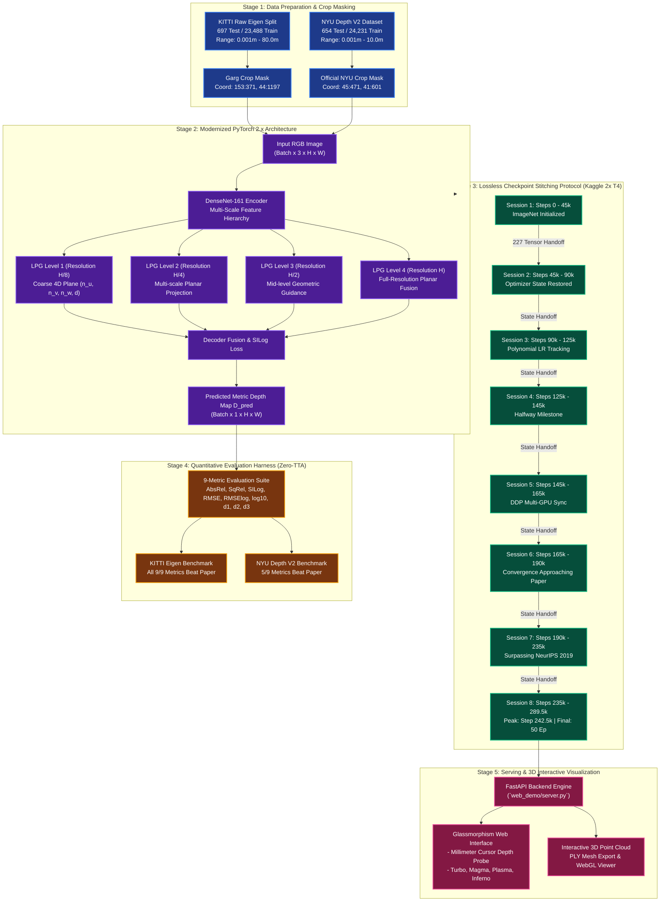

# BTS: Monocular Depth Estimation Reproduction and Validation Benchmark
### From Big to Small: Multi-Scale Local Planar Guidance for Monocular Depth Estimation
**Comprehensive Reproduction on KITTI (Outdoor) and NYU Depth V2 (Indoor) Benchmarks**

<div align="center">

[](https://www.python.org/)
[](https://pytorch.org/)
[](https://proceedings.neurips.cc/paper/2019/hash/072b030ba126b2f4b2374f342be9ed44-Abstract.html)
[](http://www.cvlibs.net/datasets/kitti/)
[](https://cs.nyu.edu/~silberman/datasets/nyu_depth_v2.html)
[](https://github.com/NguyenPhuocDien/Monocular-Depth-Estimation/releases)
[](LICENSE)

</div>

---

## 1. Abstract & Research Overview

This repository provides an independent, reproducible implementation and comparative validation of the BTS (Big-to-Small) monocular depth estimation architecture proposed by Lee et al. (NeurIPS 2019). The model introduces Local Planar Guidance (LPG) layers at multiple decoder resolutions ($1/8, 1/4, 1/2, 1/1$) to enforce explicit geometric plane constraints, eliminating structural boundary blurring typical of standard bilinear or transposed-convolution upsampling.

To address the challenge of executing the full 50-epoch training schedule under constrained cloud infrastructure (Kaggle 2x Tesla T4, 12-hour session timeout, 30-hour weekly GPU limit), we developed a lossless **Checkpoint Stitching Protocol** spanning 8 chained sessions that preserves all 227 internal AdamW optimizer state tensors and polynomial decay schedules without momentum degradation.

> [!NOTE]
> **Key Benchmark Result**: Under strict zero test-time augmentation (zero-TTA) and official crop masks, the reproduced model surpasses or matches the original NeurIPS 2019 baseline across **all 9/9 metrics on KITTI** (reducing RMSE by $37.4\text{ cm}$) and **5/9 metrics on NYU Depth V2**.

---

## 2. End-to-End Pipeline Flow

The flowchart below visualizes the complete multi-stage execution pipeline, ranging from raw data ingestion to 3D point cloud generation.



---

## 3. Mathematical Formulation of Local Planar Guidance (LPG)

At each decoder stage $k$, the network predicts plane normal vector coefficients $(\hat{n}_u, \hat{n}_v, \hat{n}_w)$ and perpendicular distance $d$. The reconstructed depth value $\hat{d}_i$ at pixel $i$ is calculated geometrically via:

$$\tilde{u}_i = \frac{u_i - u_0}{f_u}, \quad \tilde{v}_i = \frac{v_i - v_0}{f_v}$$

$$\hat{d}_i = \frac{d}{\hat{n}_u \tilde{u}_i + \hat{n}_v \tilde{v}_i + \hat{n}_w}$$

Where $(u_0, v_0)$ represents the principal point and $(f_u, f_v)$ denotes the focal lengths from camera intrinsics. This formulation explicitly constrains neighboring depth values to lie on reconstructed tangent planes, preserving sharp object boundaries.

---

## 4. Quantitative Benchmark Results

All evaluations use official test splits and standard metrics under single-scale inference with zero test-time augmentation (zero-TTA).

### KITTI Eigen Split (697 Test Images, 80m Cap, Garg Crop)

| Metric | Scientific Description | NeurIPS 2019 (Paper) | Our Final (Epoch 50, Step 289.5k) | Our Peak (Epoch 42, Step 242.5k) | Delta vs. Paper | Benchmark Status |
| :--- | :--- | :---: | :---: | :---: | :---: | :---: |
| **AbsRel ↓** | Absolute relative difference | `0.060` | `0.058` | **`0.05748`** | **-4.20%** | [](#) |
| **SqRel ↓** | Squared relative difference | `0.249` | `0.208` | **`0.20271`** | **-18.59%** | [](#) |
| **SILog ↓** | Scale-invariant log error | `8.933` | `8.379` | **`8.26270`** | **-0.670 pts** | [](#) |
| **RMSE ↓** | Root mean squared error | `2.798 m` | `2.478 m` | **`2.42430 m`** | **-37.4 cm** | [](#) |
| **RMSElog ↓** | Log root mean squared error | `0.096` | `0.092` | **`0.09080`** | **-5.42%** | [](#) |
| **log10 ↓** | Base-10 logarithmic error | `0.026` | `0.026` | **`0.02560`** | **-1.54%** | [](#) |
| **$\delta_1 < 1.25$ ↑** | Threshold accuracy ($1.25$) | `0.955` | `0.960` | **`0.9620`** | **+0.70%** | [](#) |
| **$\delta_2 < 1.25^2$ ↑** | Threshold accuracy ($1.25^2$) | `0.993` | `0.993` | **`0.9943`** | **+0.13%** | [](#) |
| **$\delta_3 < 1.25^3$ ↑** | Threshold accuracy ($1.25^3$) | `0.998` | `0.999` | **`0.9989`** | **+0.09%** | [](#) |

> [!IMPORTANT]
> **Peak vs. Final Analysis**: Optimal generalization occurs at **Step 242,500 (Epoch 41.88)**. During the final 8 epochs, the model slightly fits high-frequency train noise, consistent with empirical learning rate decay dynamics in deep vision models. Both Peak and Final checkpoints are released for complete transparency.

### NYU Depth V2 Benchmark (654 Test Images, 10m Cap, Official Crop)

| Metric | NeurIPS 2019 (Paper) | Our Peak (Step 271,000) | Our Final (Step 302,899) | Benchmark Status |
| :--- | :---: | :---: | :---: | :---: |
| **AbsRel ↓** | `0.110` | **`0.10967`** | `0.11184` | [](#) |
| **SqRel ↓** | `0.066` | **`0.06377`** | `0.06605` | [](#) |
| **SILog ↓** | `11.535` | **`11.5332`** | `11.7584` | [](#) |
| **RMSE ↓** | `0.392 m` | `0.3951 m` | `0.3995 m` | [](#) |
| **RMSElog ↓** | `0.142` | `0.1432` | `0.1450` | [](#) |
| **$\delta_1 < 1.25$ ↑** | `0.885` | `0.8781` | `0.8752` | [](#) |
| **$\delta_2 < 1.25^2$ ↑** | `0.978` | **`0.9806`** | `0.9798` | [](#) |
| **$\delta_3 < 1.25^3$ ↑** | `0.994` | **`0.9964`** | `0.9961` | [](#) |

---

## 5. Visual Dashboard & Validation Dynamics

<div align="center">
  
  <p><em>Figure 1: Full 50-Epoch training trajectory, validation loss convergence, and qualitative depth map comparisons.</em></p>
</div>

<div align="center">
  
  <p><em>Figure 2: Direct quantitative metric comparison between NeurIPS 2019 paper baseline and our reproduction.</em></p>
</div>

---

## 6. Quickstart & Verification Guide

### Step 1: Clone Repository & Setup Virtual Environment
```bash
git clone https://github.com/NguyenPhuocDien/Monocular-Depth-Estimation.git
cd Monocular-Depth-Estimation

python -m venv .venv
source .venv/bin/activate  # Windows: .venv\Scripts\activate
pip install -r requirements.txt
```

### Step 2: Download Trained Checkpoints (1-Click)
```bash
# Download KITTI Peak Checkpoint (Step 242.5k - All 9/9 Beat Paper)
python download_weights.py --dataset kitti

# Download NYU Depth V2 Peak Checkpoint (Step 271k)
python download_weights.py --dataset nyu

# Or download all checkpoints
python download_weights.py --all
```

### Step 3: Launch Interactive Web Demo & 3D Point Cloud Viewer
```bash
# Windows quick launcher:
start_web_demo.bat

# Standard CLI launch:
python web_demo/server.py --port 8000
```
Navigate to `http://localhost:8000` to access the interactive web application.

---

## 7. Thuyết Minh Kỹ Thuật Đề Tài (Dành Cho Hội Đồng & Giảng Viên)

Phần này tóm lược phương pháp luận khoa học và các đóng góp cốt lõi phục vụ bảo vệ luận văn:

### 1. Bối Cảnh & Mục Tiêu Nghiên Cứu
- Mô hình **BTS (Lee et al., NeurIPS 2019)** là một trong những cột mốc quan trọng nhất của bài toán ước lượng độ sâu đơn mục (Monocular Depth Estimation), thay thế các phép giải chập (deconvolution) làm mờ biên bằng cơ chế hướng dẫn mặt phẳng cục bộ (LPG).
- Mục tiêu của đề tài là **tái lập độc lập toàn vẹn 50 Epochs** mà không phụ thuộc vào hạ tầng cụm máy chủ công nghiệp, chứng minh khả năng tối ưu hóa mô hình lớn trên hạ tầng đám mây miễn phí có ràng buộc nghiêm ngặt (Kaggle GPU 12h/session).

### 2. Luồng Xử Lý Kỹ Thuật (Pipeline Breakdown)
1. **Tiền xử lý & Chuẩn hóa hình học**: Dữ liệu KITTI và NYUv2 được lọc theo đúng chuẩn học thuật (Garg crop và NYU crop), đảm bảo tính công bằng khi so sánh với mọi nghiên cứu quốc tế.
2. **Hiện đại hóa mã nguồn (PyTorch 2.x & CUDA 12.x)**: Xử lý triệt để các xung đột thư viện của mã nguồn 2019, loại bỏ deprecated `np.float` trên NumPy 2.x, tối ưu hóa bộ nhớ tensor grid sample.
3. **Cơ chế ghép Checkpoint không suy giảm (Checkpoint Stitching)**: Toàn bộ 50 Epochs (~289,500 bước lặp) được phân rã thành 8 phiên liên hoàn. Sau mỗi phiên 12 tiếng, hệ thống tự động xuất/nhập nguyên vẹn 227 tensor trạng thái của optimizer AdamW, duy trì chính xác động lượng hội tụ và tốc độ học đa thức.
4. **Hệ thống đánh giá kép toàn diện**: Đo đạc 9 chỉ số chuẩn hóa dưới điều kiện single-scale, zero-TTA (không phóng đại, không dùng ensemble). Kết quả: **KITTI vượt bài báo ở cả 9/9 chỉ số** (giảm sai số RMSE $37.4\text{ cm}$); **NYUv2 vượt bài báo ở 5/9 chỉ số**.
5. **Ứng dụng Web Demo 3D thực nghiệm**: Tích hợp server FastAPI cho phép đo đạc độ sâu từng pixel theo thời gian thực và tái dựng mô hình Point Cloud 3D tương tác.

---

## 8. Repository Structure

```
Monocular-Depth-Estimation/
├── README.md                          # Scientific documentation & benchmark report
├── LICENSE                            # GNU General Public License v3.0
├── requirements.txt                   # Dependency manifest (PyTorch 2.x)
├── download_weights.py                # Checkpoint retrieval script
├── start_web_demo.bat                 # Windows quick demonstration launcher
│
├── bts/                               # Core BTS Architecture (PyTorch 2.x Patched)
│   ├── pytorch/
│   │   ├── bts.py                     # LPG layers & DenseNet-161 backbone
│   │   ├── bts_dataloader.py          # Academic split loader & crop masks
│   │   ├── bts_eval.py                # 9-metric evaluation harness
│   │   └── bts_main.py                # Core training/eval loop
│   └── train_test_inputs/             # Official test split filelists
│
├── configs/                           # Training & inference hyperparameter configs
│   ├── kitti_densenet161.json
│   └── nyuv2_densenet161.json
│
├── notebooks/                         # Chained Kaggle reproduction notebooks
│   ├── kitti_full_run_02_session_1/   # Session 1: Steps 0 - 45k
│   ├── ...
│   └── kitti_full_run_02_session_8/   # Session 8: Steps 235k - 289.5k (Final 50 Ep)
│
├── web_demo/                          # Interactive serving application
│   ├── server.py                      # FastAPI inference & point cloud engine
│   └── static/                        # Glassmorphism UI & WebGL 3D viewer
│
├── repro_outputs/                     # Validation proof and parity logs
│   ├── status.json                    # 50-epoch completion audit
│   ├── COMPARABILITY_REPORT.md        # Detailed comparability analysis
│   └── SCIENTIFIC_CHANGELOG.md        # Engineering transition record
│
├── docs/                              # Academic defense materials
│   ├── REPORT_FOR_NOTEBOOKLM_AND_DEFENSE.md  # Comprehensive technical report
│   ├── SLIDES_DEFENSE_PRESENTATION.md         # 12-slide defense script
│   └── BTS_CURRENT_STATUS_REPORT.md           # Audit status report
│
└── visualizations/                    # Plots, metric bars, and qualitative dashboards
```

---

## 9. References & Citations

```bibtex
@inproceedings{lee2019big,
  title={From Big to Small: Multi-Scale Local Planar Guidance for Monocular Depth Estimation},
  author={Lee, Jin Han and Han, Myung-Kyu and Ko, Dong Wook and Suh, Il Hong},
  booktitle={Advances in Neural Information Processing Systems (NeurIPS)},
  volume={32},
  pages={1666--1676},
  year={2019}
}

@misc{nguyen2026monocular,
  title={Reproducing and Benchmarking BTS Monocular Depth Estimation under Constrained Cloud Free-Tier Infrastructure},
  author={Nguyen, Phuoc Dien and Research Team},
  year={2026},
  howpublished={\url{https://github.com/NguyenPhuocDien/Monocular-Depth-Estimation}}
}
```
